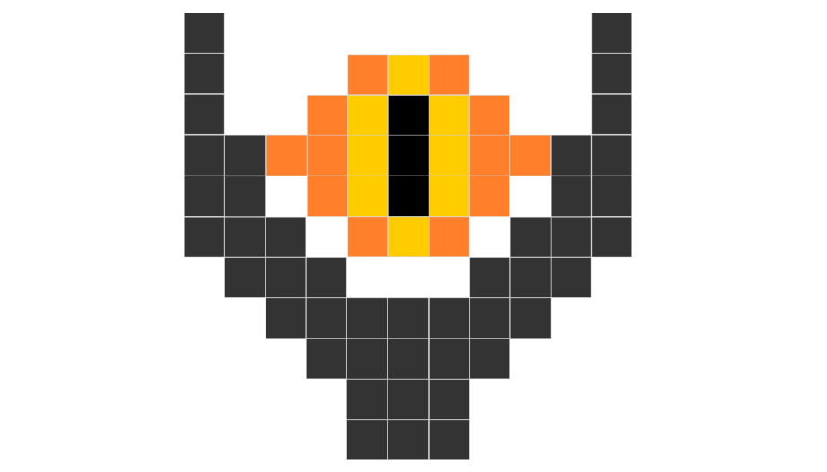

# [Lord of The Rings](https://lgiacalo.github.io/gridBootstrap/)

## Consignes

- En utilisant uniquement le système de grille, reproduis le Grand Œil selon l'image ci-dessus.

NB : tu n'es pas obligé·e de laisser un espace entre chaque case, ceux-ci sont présents sur le schéma pour que tu puisses repérer les cases plus facilement.

## Critères de validation

- Les fichiers CSS et JS liés à Bootstrap sont correctement appelés.
- Le système de grille Bootstrap est utilisé.
- Le Grand Œil sur sa tour de Barad-Dûr est une reproduction fidèle de l'image fournie (positionnement des cases et couleurs).
- Le résultat est responsive : il ne doit être pas se déformer sur tablette, pc ou téléphone.

NB : si les cases ne sont pas exactement carrées sur certaines tailles d'écran, ce n'est pas grave tant que le dessin est reconnaissable. Pour les tout petits écrans, si tu as des décalages, intéresse-toi à la classe no-gutters de Bootstrap.