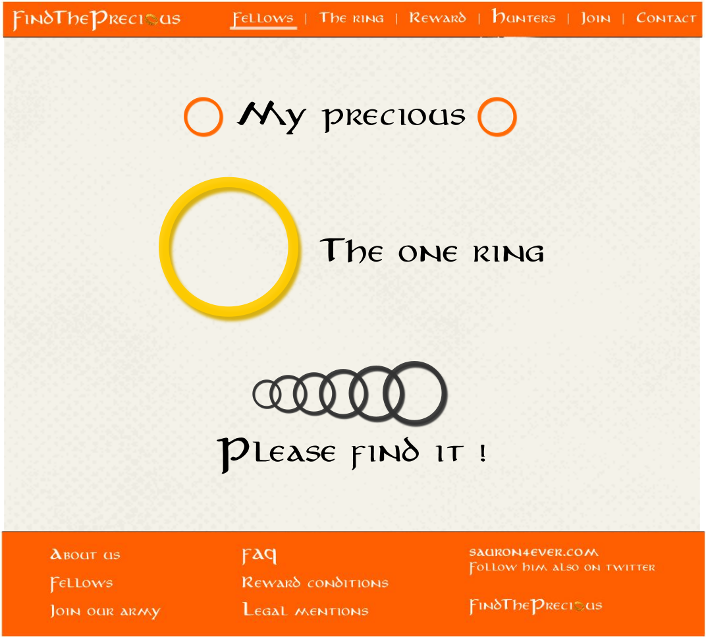

# [Preprocesseur CSS - SCSS](https://lgiacalo.github.io/quetescss/)

## Challenge

Afin de donner plus de style au site findThePrecious, Sauron veut être en mesure d'ajouter des anneaux sur ses pages.
Plein d'anneaux, des grands, des petits, avec plein de couleurs différentes !
Tu devras donc, à l'aide de SCSS, créer une mixin appelée ring qui permet de dessiner un anneau.

Cette mixin doit te permettre :

1. De choisir une taille et une couleur pour l'anneau
2. Une ombre colorée doit apparaître (en fonction de la taille et de la couleur choisie)
3. L'épaisseur de l'anneau doit être fonction de la taille choisie

Une fois cette mixin créée, réalise une simple page HTML, appelée precious.html, correspondant à l'image ci-dessous et reprenant le header (et optionnellement le footer) réalisé dans la quête intégration finale.

    Hint : Utilise une boucle for en SCSS pour afficher la succession de 6 anneaux horizontaux imbriqués, de plus en plus grands.

Poste le résultat sur une page github. Tu peux reprendre et compléter ton projet findThePrecious posté lors de la quête "intégration finale", et y ajouter cette nouvelle page HTML.

---

## Critères de validation

1. Le projet contient les fichiers SCSS et les fichiers CSS compilés à partir du SCSS.
2. La page precious.html charge ce CSS et le résultat obtenu correspond à la maquette.
3. Ce code SCSS suit les bonnes pratiques (nesting, variables...)
4. Une mixin permet de dessiner facilement des anneaux.
5. Une boucle for est utilisée pour générer les 6 anneaux imbriqués.

## [View Website with scss](https://lgiacalo.github.io/quetescss/)
